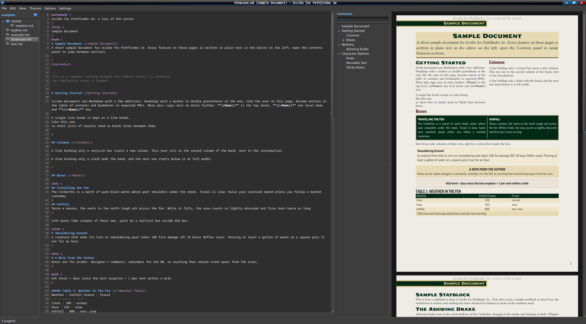

# Scribe for Pathfinder 2e

This is a standalone program written in C++ using Qt6 to render custom markdown files used for the scribe.pf2.tools website to a PDF.  This was built out of a desire to not rely on a web-based service to produce formatted homebrew documents for the Pathfinder 2e system.  For my personal use, I like to use a native program wherever possible for my tasks.

## Building and Running

### Dependencies
- Qt 6.4 or newer (Widgets)
- CMake 3.21 or newer
- A compiler with C++20 support
- (optional) fontconfig
- (optional) Ghostscript 9.50 or newer (tested with 10.08), for an option to shrink the file size of exported PDF files
- (optional) ImageMagick 6 or 7 (tested with 7.1), for resizing images to fit the PDF

On Arch or an Arch-based distro, you can install the dependencies to build this program with

```sh
sudo pacman -S qt6-base cmake fontconfig
sudo pacman -S --needed ghostscript imagemagick   # optional
```

For other Linux distributions, refer to your distro's package list for these dependencies.  I have only tested this on my EndeavourOS installation.  Theoretically it should compile and run on Windows as well but this is completely untested.

### Building

Simply run `./build.sh` or run

```sh
cmake -B build -DCMAKE_BUILD_TYPE=Release
cmake --build build -j6
```

If you have non-free fonts in your `fonts/` directory (see Fonts below), also add `-DSCRIBE_EMBED_ALL_FONTS=ON` so they can be included.

### Running

Simply run `./build/pf2scribe [file.md]`

#### Basic Usage
- File -> Open or Open Folder (opens the file tree)
- File -> Export PDF (Ctrl+E)
- Settings are saved in `~/.config/pf2scribe/pf2scribe.conf`

#### Vim Mode
- Key mappings are read from `~/.vimrc`, `~/.vim/vimrc`, or `~/.config/vim/vimrc`, but Vim plugins are not loaded.
- Vim macros and multi-file commands are not implemented or supported.
- The Edit menu still works in Vim mode, through Vim's own commands.

## Fonts

Fonts are expected to live in a `fonts/` directory next to the executable, in the current directory, or installed system-wide.  Fonts in `fonts/` are built into the executable when you build it.

The expected fonts used are listed in `fonts/README.txt` and any fonts not provided here can be found at the links provided in that README.  If the expected fonts are not installed, the program will use fallback fonts if those are installed.  These fallback fonts can be found in `src/Rendering/Theme.h` and the first one installed is used.

If the Pathfinder-Icons font is not installed, any `:a:`, `:aa:`, `:aaa:`, `:f:`, and `:r:` will render as that text instead of a blank square.  If Pathfinder-Icons is installed, they will be replaced with the proper Pathfinder 2e action icon.

## Features

The following features are improvements upon the original website's rendering that are unique to this project.

- Added an option to toggle on Vim motions and commands.
- Added an option to toggle compact line spacing to better match how Monster Core is formatted.
- Added an option to toggle syntax highlighting for the markdown editor.  This syntax highlighting is aware of custom scribe markdown formatting such as `item( )` blocks.
- When exporting the PDF, it will automatically embed `((Name))`, `((+Name))`, `((++Name))`, etc. blocks as bookmarks/outline.  This brings in the table of contents you may have generated for your homebrew, which is especially useful for large documents.
- Images are loaded from local files (no image hosting needed) and embedded in the exported PDF.
- A file tree view is provided for working on multiple scribe markdown files at once, though only the file being worked on is ever rendered.
- All keyboard shortcuts are rebindable under Settings -> Keyboard Shortcuts.
- An index.info file of bookmarks can be exported if the user wants to apply them with Ghostscript by hand.
- Text will flow around the sidebars and images, widening to full width below them, even mid-paragraph.
- Themes: Pathfinder 2e, Pathfinder 2e Remaster, and Starfinder 2e are now all options from from the Themes menu.

### Differences from the Website

#### Images

Web images are not loaded.  If you used imgur links or other web-hosted images in the scribe.pf2.tools website markdown files, they will **not** work in this program.

If you want to use images, they should be located relative to the markdown file, e.g. `` where Resource is a subdirectory in the same directory as the markdown file.  When exporting to PDF, these images will be embedded in the PDF.  As a fallback, the program will check for a `Resources/` directory next to the markdown file if it is not explicitly stated, e.g. `` will look next to the markdown file first for the image file, then in a `Resources/` directory next to the markdown file for `sample_image.png`.

##### Recommended Image Size

When using images in a sidebar (the typical case for my usage), the recommended width of an image is 644px.  Use the included `tools/scripts/resize_image.sh` script to resize images as needed.

A full-width image is roughly 1950px in width.  `resize_image.sh -w 1950 [image.png]` will handle resizing an image to this size.

##### Transparent PNGs

Unlike the website, adding a transparent PNG will allow the text to follow the image's outline.

#### Markdown Syntax

See the included `samples/showcase.md` for a tour of the syntax.  The existing scribe.pf2.tools website's syntax is supported, with the exception of the following:
- `css()` blocks are kept but not applied.
- `fonts()` Google Fonts imports aren't used.
- The website's external references to http://monster.pf2.tools, http://template.pf2.tools, and other scribe entries are ignored.

## Features Enabled by Optional Software

#### Ghostscript

If you have Ghostscript installed, an option to Shrink PDFs (Options -> Shrink PDFs with Ghostscript) will be available to compress the PDF so even documents with lots of images embedded will be reasonable in file size.  This option is off by default.  If Ghostscript is not installed prior to running pf2scribe and is installed while the program is running, it will need to be restarted.  The option will be greyed out in the menu unless Ghostscript is installed on program start.

If this feature is used, images will be recompressed again.  The trade-off here is a slight quality loss of embedded images for a smaller PDF file size.

#### ImageMagick

If you have ImageMagick installed, or want to have it installed, the use of `tools/scripts/resize_image.sh` uses ImageMagick (prompting to install on an Arch-based distro using pacman if it is not already installed) to help resize images to the maximum 644px in width recommended for clearness when being rendered in the PDF.

## Showcase Image



## AI Disclosure

This project was built using Claude Code.  However, I am a C++ programmer by profession so I am able to read and understand the code that Claude generates.  I aim to extensively test the project using actual example markdown files I've used on the scribe.pf2.tools website, including one extremely large 10k+ line document complete with 200+ images embedded, to stress test this project.

## License

This project is licensed under GPL version 3, or (at your option) any later version.

## Legal Notice

This project is not affiliated with the pf2.tools website.  The original web version is at https://scribe.pf2.tools, which this program is modelled on.

This project uses trademarks and/or copyrights owned by Paizo Inc., which are used under Paizo’s Community Use Policy. We are expressly prohibited from charging you to use or access this content. This project is not published, endorsed, or specifically approved by Paizo Inc. For more information about Paizo’s Community Use Policy, please visit paizo.com/communityuse. For more information about Paizo Inc. and Paizo products, please visit paizo.com.