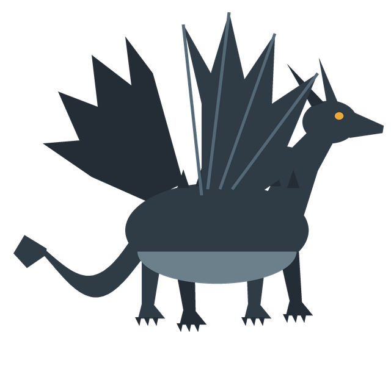

watermark (
Scribe for Pathfinder 2e: a tour of the syntax
)
title (
Sample Document
)
head (
# Sample Document ((Sample Document))
A short sample document for Scribe for Pathfinder 2e. Every feature on these pages is written in plain text in the editor on the left; open the Contents panel to jump between sections.
-
)
pagenumbers

<!--
This is a comment: nothing between the comment markers is rendered.
The highlighter shows it dimmed.
-->

# Getting Started ((Getting Started))

Scribe documents are Markdown with a few additions. Headings with a marker in double parentheses at the end, like the ones on this page, become entries in the table of contents and bookmarks in exported PDFs. More plus signs nest an entry further: **((Name))** is the top level, **((+Name))** one level down and **((++Name))** two.

A single line break is kept as a line break,
like this one,
so short lists of results need no blank lines between them.

|

## Columns ((+Columns))

A line holding only a vertical bar starts a new column. This text sits in the second column of the band, next to the introduction.

A line holding only a slash ends the band, and the next one starts below it at full width.

/

## Boxes ((+Boxes))

info (
## Travelling the Fen
The Cinderfen is a marsh of warm black water where peat smoulders under the reeds. Travel is slow: halve your overland speed unless you follow a marked causeway.
|
## Ashfall
Twice a season, the vents to the north cough ash across the fen. While it falls, the area counts as lightly obscured and fires burn twice as long.
)

Info boxes take columns of their own, split by a vertical bar inside the box.

rules (
# Smouldering Ground
A creature that ends its turn on smouldering peat takes 1d6 fire damage (DC 18 basic Reflex save). Pouring at least a gallon of water on a square puts it out for an hour.
)

note (
# A Note from the Author
Notes are for asides: designer's comments, reminders for the GM, or anything that should stand apart from the rules.
)

math (
Ash level = days since the last eruption + 1 per vent within a mile
)

##### Table 1: Weather in the Fen ((++Weather Table))
Weather | Ashfall Chance | Travel
--- | :---: | :---
Clear | 10% | normal
Haze | 35% | slow
Ashfall | 80% | very slow
. * Roll once each morning; ashfall lasts until the next morning.

=
# Sample Statblock
This is how a statblock is done in Scribe for Pathfinder 2e.  Note this is just a sample statblock to show how the markdown is written and nothing has been checked for balance in terms of the numbers used.

# The Ashwing Drake ((Bestiary))
Ashwing drakes nest in the warm hollows of the Cinderfen, sleeping in the smoke and hunting at dusk. Villagers leave out offerings of charcoal in the hope that a passing drake will take the gift and leave the goats alone.

right(
# Charcoal Offerings
A drake that accepts an offering is friendly for a day, as long as no one approaches its nest.

<!--
A note on image embedding.  Images can be embedded using the following syntax, where the path is relative to the markdown file:

``

The image will be embedded into the generated PDF, and if you have Ghostscript installed, it should compress the PDF so the file size won't become super bloated with a ton of images embedded.
-->
)

item(
# Ashwing Drake ((+Ashwing Drake))
## Creature 6
-
;Uncommon,N,Large,Dragon,Fire
**Perception** +14; darkvision, smoke vision

**Languages** Draconic

**Skills** Acrobatics +13, Athletics +15, Intimidation +12, Stealth +13

**Str** +5, **Dex** +3, **Con** +4, **Int** -1, **Wis** +2, **Cha** +1

**Smoke Vision** The drake ignores the concealed condition from smoke and ash.
-
**AC** 24; **Fort** +16, **Ref** +13, **Will** +12

**HP** 105; **Immunities** fire, sleep; **Weaknesses** cold 5

**Ember Guard** :r: **Trigger** A creature within reach hits the drake with a melee Strike. **Effect** The drake shakes burning ash from its wings; the triggering creature takes 2d6 fire damage (DC 24 basic Reflex save).
-
**Speed** 25 feet, fly 50 feet

**Melee** :a: jaws +17 (magical), **Damage** 2d10+8 piercing plus 1d6 fire

**Melee** :a: tail +17 (agile, reach 10 feet), **Damage** 2d6+8 bludgeoning

**Cinder Breath** :aa: (arcane, fire) The drake breathes a 30-foot cone of smouldering cinders that deals 7d6 fire damage (DC 24 basic Reflex save). It can't use Cinder Breath again for 1d4 rounds.
**Critical Success** The creature is unharmed.
**Success** The creature takes half damage.
**Failure** The creature takes full damage and 1d6 persistent fire damage.
**Critical Failure** The creature takes double damage and 2d6 persistent fire damage.

**Rapidfire Jaws** :f: **Frequency** once per minute; **Trigger** The drake is making a jaws Strike; **Effect** The drake supercharges the fire in its jaws, increasing the fire of its jaws Strike from 1d6 to 2d8.

**Wing Gust** :aaa: The drake beats its wings and flies up to half its fly Speed. Each creature it passes over must succeed at a DC 24 Fortitude save or be knocked prone. The ash it stirs up leaves the area lightly obscured until the start of the drake's next turn.
)

=

# Character Options ((Character Options))

left (
# Fen Folk
The people of the Cinderfen build on stilts, cook over peat and know the smell of an eruption days before it comes.

Many of them carry a lantern of green glass, which glows brighter as the ash level rises.
)

The feats below are written as items, like the drake's stat block. A heading of level four, such as the ones above each feat, becomes a feat bar.

Text beside a sidebar flows around it and widens to the full width as soon as it passes the sidebar's bottom edge, even in the middle of a paragraph. This paragraph is long enough to show it: by the time it reaches its last lines, the sidebar on the left has ended, and the lines run across the whole page again instead of staying in a narrow column for the rest of the section.

/

#### 1st Level ((+Feats))

item(
# Ash Reader :a:
## Feat 1
-
;Uncommon,General,Skill
**Prerequisites** trained in Survival
-
You read the color and drift of falling ash. You learn the current ash level and the direction of the nearest active vent.
)

|

#### 4th Level

item(
# Lantern Ward :r:
## Feat 4
-
;Uncommon,General
**Trigger** A creature within 15 feet would take fire damage.
-
You raise your green-glass lantern; the target gains resistance 5 to fire against the triggering damage.
)

/

## Reusable Text ((+Reusable Text))

A name followed by an opening brace starts a piece of reusable text, which ends at a line holding only a closing brace. A name in double braces repeats it anywhere:

causeway {
**Marked Causeway** A creature on a marked causeway moves at full speed through the Cinderfen.
}

Some text to split the repeated example.

{{causeway}}

## Sticky Notes ((+Sticky Notes))

Sticky notes sit on top of the page at a position given in millimetres from its top-left corner, out of the flow of the text.

sticky(140 240
Remember to roll
for ashfall!
)

%
Everything after a line holding only a percent sign is hidden: notes to yourself that never appear on the page.
